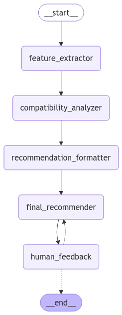

# SchoolMatch AI

An AI-powered tool for identifying potential merger and acquisition (M&A) partners for educational institutions, leveraging LangChain and LangGraph for intelligent analysis and recommendations.

## Overview

SchoolMatch AI uses advanced language models and semantic search to analyze potential M&A partners for educational institutions. The system follows a structured workflow:

1. Feature Extraction
   - Analyzes input institution details
   - Identifies key characteristics and requirements
   - Extracts searchable features

2. Compatibility Analysis
   - Performs semantic search across potential partners
   - Evaluates strategic alignment
   - Generates detailed compatibility scores
   - Considers multiple dimensions:
     - Financial compatibility
     - Academic program alignment
     - Cultural fit
     - Market positioning

3. Recommendation Generation
   - Formats detailed analyses for each potential partner
   - Generates comprehensive M&A recommendations
   - Provides structured reports with:
     - Executive summaries
     - Strategic rationale
     - Risk assessments
     - Next steps

4. Interactive Feedback
   - Collects user feedback on recommendations
   - Refines suggestions based on input
   - Allows for iterative improvement

## Architecture


The system uses a LangGraph-based workflow with the following components:

- **Feature Extractor**: Processes input institution details
- **Compatibility Analyzer**: Evaluates potential partners using vector search
- **Recommendation Formatter**: Structures detailed analyses
- **Final Recommender**: Generates comprehensive M&A recommendations
- **Human Feedback**: Enables interactive refinement

## Technologies

- LangChain: Framework for LLM application development
- LangGraph: For building structured AI workflows
- Vector Store: For semantic search of institutions
- Pydantic: For data validation and state management

## Setup

1. Create a virtual environment:
   ```bash
   python -m venv env
   source env/bin/activate  # On Windows: env\Scripts\activate
   ```

2. Install dependencies:
   ```bash
   pip install -r requirements.txt
   ```

3. Set up environment variables:
   Create a `.env` file with:
   ```
   OPENAI_API_KEY=your_api_key_here
   ```

## Usage

1. Initialize the system:
   ```python
   from langchain_app.school_matcher_graph import create_school_matcher_graph, run_school_matcher
   from db.college_vector_store import CollegeVectorStore

   # Initialize vector store
   vector_store = CollegeVectorStore()
   
   # Create graph
   graph = create_school_matcher_graph(vector_store)
   ```

2. Run analysis:
   ```python
   # Describe your institution
   school_description = """
   A private liberal arts college with 2,000 students,
   strong humanities programs, and interest in expanding STEM offerings.
   Located in New England with $50M endowment.
   """
   
   # Run analysis
   run_school_matcher(graph, school_description, {})
   ```

3. Provide feedback:
   - Review recommendations
   - Input feedback when prompted
   - Get refined recommendations based on your input

## Project Structure

```
schoolmatch_v1/
├── langchain_app/
│   ├── nodes/                    # Graph components
│   │   ├── extract_target_features/  # Feature extraction
│   │   ├── compatibility_analyzer/   # Partner analysis
│   │   ├── rec_formatter/           # Recommendation formatting
│   │   ├── final_rec/              # Final recommendation
│   │   └── human_feedback/         # Feedback handling
│   └── utils/                    # Utility functions
├── db/                          # Vector store implementation
├── models/                      # Data models
└── data/                        # Resources and data
```

## Contributing

1. Fork the repository
2. Create a feature branch
3. Commit your changes
4. Push to the branch
5. Create a Pull Request
